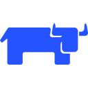

  
  

  
  
  
  

  <h1>
  echo "Hello World!
  " > /etc/greeting
  </h1>

### :white_check_mark: ToDo :

- [ ] Own terraform provider
- [ ] Mono-Repo with DevOps technologies
- [ ] Kubernetes the Hard-Way
- [ ] The Phoenix Project

---

### :man_technologist: About Me :
I am a DevOps Engineer  from Russia.

- :man_student: I'm a student at Sirius University working with networks.
- :computer: I work as a Jr. DevOps Engineer, automating everything.
- :floppy_disk: I develop my mono-repo with DevOps technologies
- :mailbox: How to reach me: 
-  I use arch btw.

---

### :hammer_and_wrench: Technologies :
#### Now:

  &nbsp;
  
  
  
  
  
  
  
  
  
  
  
  
  

#### In progress

  
  
  
  
  
  
  
  
  
  
  
  
  
  

<!-- 
for i in []:
    tech = i.split("/")[-1]
    print(f"")
 -->

---
### :fire: My Stats :

